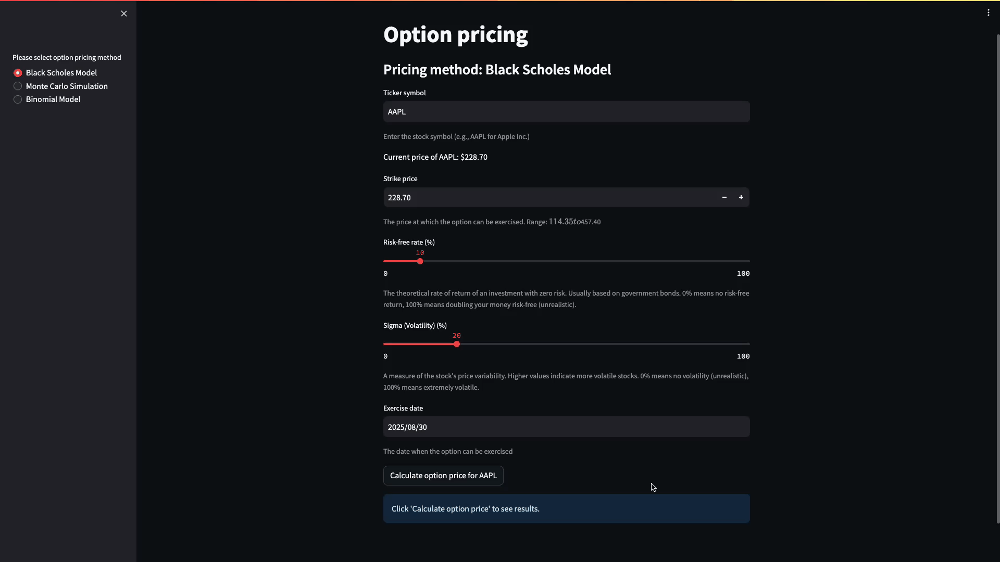
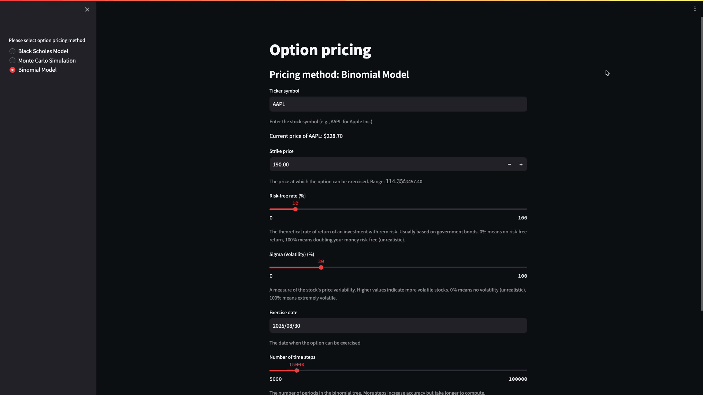

Got it — you want to personalize and rephrase the README so it feels **authentically yours** and not just a copy of someone else's work. Below is a **completely rewritten, 
# 🧠 Option Pricing Simulator

### 📍 Maintained by [Nishant Malhotra](https://github.com/Nishant-8009)  
📫 Contact: nishantmalhotra8009@gmail.com

---

## Overview

This web-based simulator allows users to evaluate the price of European options using multiple quantitative models. Built with **Python** and **Streamlit**, it offers an intuitive interface for finance learners and practitioners to test different pricing assumptions.

---

## 📊 Supported Models

The application includes three well-established option pricing approaches:

- **Black-Scholes Formula**:  
  Analytical model suited for European options under constant volatility and no dividends.

- **Monte Carlo Estimation**:  
  A simulation-based method that generates multiple price trajectories to estimate option value probabilistically.

- **Binomial Tree Method**:  
  A time-discretized pricing model that builds an asset price tree and works backward to determine option price.

---

## 🔧 Functionality

- Real-time market data via Yahoo Finance (`pandas-datareader`)
- Input fields for:
  - Strike price
  - Time to expiry
  - Risk-free rate
  - Volatility (σ)
- Output comparison across all three pricing models
- Automatic caching to limit repeated API calls
- Easy-to-use UI built with Streamlit

---

## 📁 Directory Contents

- `option_pricing/` — Core logic and model definitions  
- `streamlit_app.py` — Streamlit UI entry point  
- `demo/` — Short demos of each pricing model  
- `Dockerfile` — Deployment setup using Docker  
- `requirements.txt` — List of dependencies

---

## ▶️ Run the App Locally (Docker)

If you have Docker installed, follow these steps to run the app:

```bash
docker build -t option-simulator .
docker run -p 8080:8080 option-simulator
```

Visit [http://localhost:8080](http://localhost:8080) in your browser.

---

## ☁️ Deploy on Google Cloud (Optional)

You can deploy the application on GCP using App Engine:

1. Set up a Google Cloud Project and enable billing
2. Configure your SDK:

   ```bash
   gcloud config set project YOUR_PROJECT_NAME
   gcloud app deploy
   ```
3. Once deployed, visit the app URL provided in the terminal or console.

---

## 🎬 Model Demonstrations

Each model includes a short visual demo:

* **Black-Scholes Model**
  

* **Monte Carlo Simulation**
  

* **Binomial Tree Method**
  

---

## 🎓 Use Cases

This project is great for:

* Students studying financial engineering or derivatives
* Developers exploring financial modeling
* Practitioners validating option pricing techniques

---

## 📜 Notes

This project is open for learning and experimentation purposes only. It does not offer investment advice.

---

**© 2025 Nishant Malhotra**
[GitHub Profile](https://github.com/Nishant-8009)
